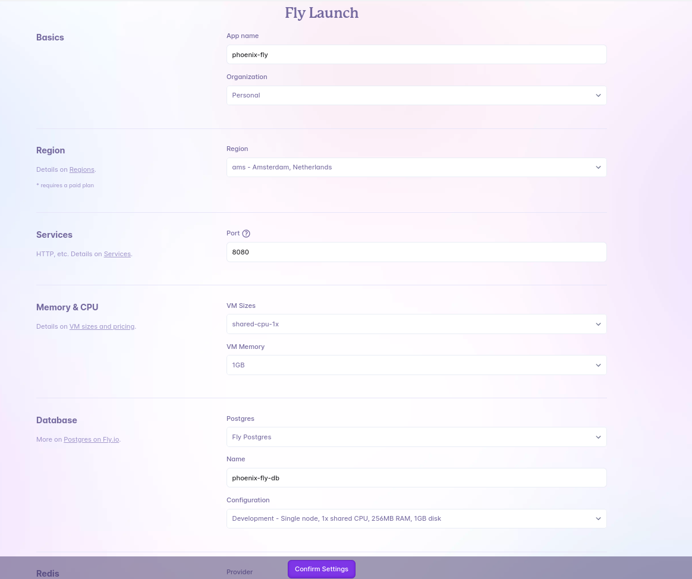

# Fly.io

## Phoenix Application

Generate a Phoenix application:

```shell
mix phx.new phoenix_fly --install
```

Init the repository and commit changes:

```shell
git init
git add .
git commit -m "Initial"
```

Launch Fly and answer yes when asked to tweak setting:

```shell
fly launch
```

```output
? Do you want to tweak these settings before proceeding? (y/N)
```

Set Database settings and change other settings:



Wait for for the setup to complete. The DB migration will be run on every deploymnet. See `release_command: /app/bin/migrate` in `fly deploy` logs.

Open the application to check:

```shell
fly open
```

Show the files generated by `fly launch`:

```shell
git status -u
```

````output
.dockerignore
Dockerfile
fly.toml
lib/phoenix_fly/release.ex
rel/env.sh.eex
rel/overlays/bin/migrate
rel/overlays/bin/migrate.bat
rel/overlays/bin/server
rel/overlays/bin/server.bat
```
