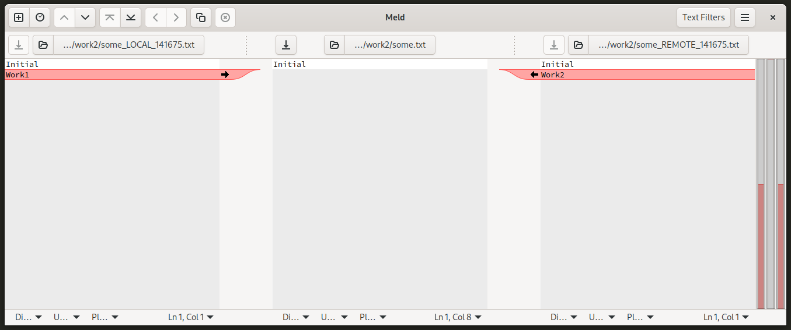

# diff

## Config Conflict Style and Merge Tool

```shell
git config --global merge.conflictStyle diff3
git config --global merge.tool meld
```

## diff

Prepare the repo and two working directories with the same content:

```shell
# Create a new empty repo and checkout it to working folders
mkdir repo &&
cd $_ &&
git init --bare
cd ..

# Clone the repo to working folders
git clone ./repo work1
git clone ./repo work2


# Go to `work1` folder, create a file and push to the repo
cd work1

cat <<EOF > some.txt
Initial
EOF

git add .

git commit -m "Initial"
git push

cd ..

# Update `work2` folder:
cd work2
git pull

cd ..
```

Start develoment in branches:

```shell
cd work1 && git checkout -b work1-feature && cd ..
cd work2 && git checkout -b work2-feature && cd ..
```

Make different changes in the working folders:

```shell
cat <<EOF >> ./work1/some.txt
Work1
EOF

cat <<EOF >> ./work2/some.txt
Work2
EOF
```

Commit `work1` changes, them merge into the main branch and push:

```shell
cd work1
git add .
git commit -m "Work1 added"
git push
git checkout main
git merge work1-feature
git push
cd ..
```

Go to `work2` and commit the changes:

```shell
cd work2
git add .
git commit -m "Work2 added"
```

Get the latest main and try to rebase from it:

```shell
git checkout main
git pull
git checkout work2-feature
git rebase main
```

```output
Auto-merging some.txt
CONFLICT (content): Merge conflict in some.txt
error: could not apply 0204a3d... Work2 added
hint: Resolve all conflicts manually, mark them as resolved with
hint: "git add/rm <conflicted_files>", then run "git rebase --continue".
hint: You can instead skip this commit: run "git rebase --skip".
hint: To abort and get back to the state before "git rebase", run "git rebase --abort".
Could not apply 0204a3d... Work2 added
```

Git switches to the latest repo commit, it is shown in a shell if plugin is installed. `HEAD` is the latest commit in the repo.

The file will have the following content for merge style:

```
Initial
<<<<<<< HEAD
Work1
=======
Work2
>>>>>>> 0b5c94f (Work2)
```

And for diff3 style:

```
Initial
<<<<<<< HEAD
Work1
||||||| parent of 0e09ed7 (Work2 added)
=======
Work2
>>>>>>> 0e09ed7 (Work2 added)
```

`git mergetool` result for `merge` style:


`git mergetool` result for `diff3` style:



The result is the same. Please note that `LOCAL` branch is the main branch when doing rebase and `REMOTE` branch is a feature branch.
